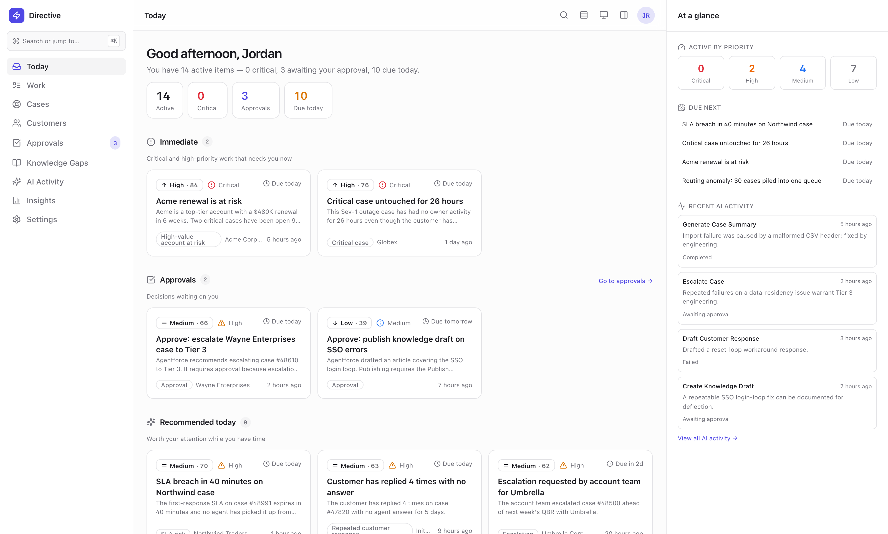
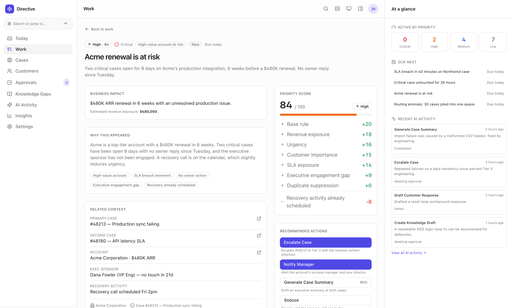
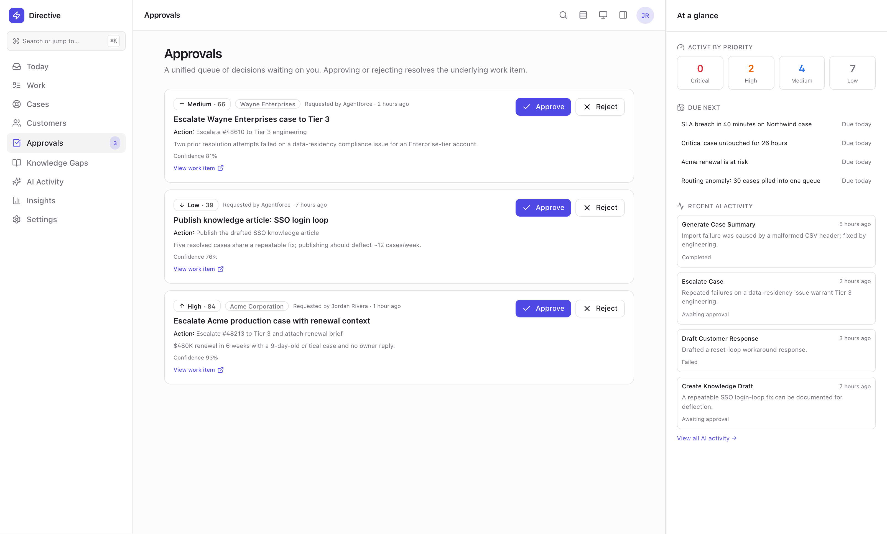
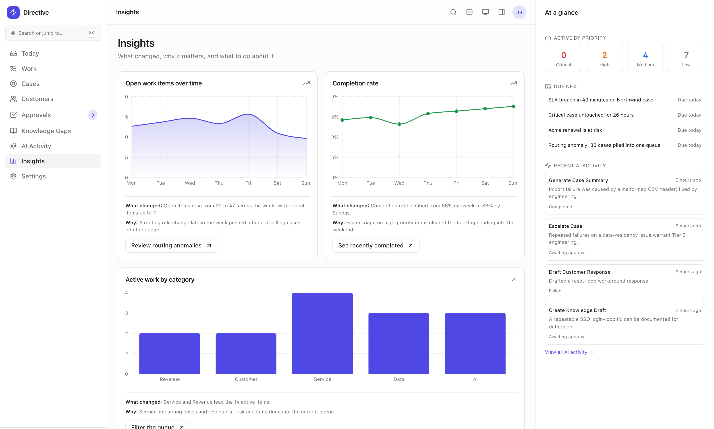

# Directive

**Salesforce holds the work. Directive tells you what to do next.**

Intelligent work-orchestration for Salesforce - a native app that detects business
signals, converts them into prioritized, explainable work items, recommends the next
best action, and lets a user execute it without leaving the workspace.

This repository is the **Service Operations MVP** described in the product spec: the
complete operational loop (Detect → Understand → Prioritize → Explain → Execute → Measure)
for a service-ops persona.

---

## Screenshots

Captured from the Directive UI.

| | |
|---|---|
|  |  |
| **Today.** Immediate work leads the page, then the decisions waiting on you, then what is worth attention while you still have time. The right rail carries the priority mix, what is due next, and what the agents have been doing. | **Work detail.** The priority score broken into every component that produced it, including the one that lowered it. A recovery call already on the calendar subtracts 8, and the page says so. |
|  |  |
| **Approvals.** One queue for every decision waiting on a person. Each carries the action it will take, the reason it was proposed, and a confidence score, so approving is a judgement rather than a guess. | **Insights.** Every chart states what changed and why, then ends in the action that follows from it. A rising queue is only useful if it names the routing rule that caused it. |

---


## What's in here

```
directive/
├── CONTRACT.md                     # Single source of truth for shared API names
├── sfdx-project.json               # SFDX project (API v61.0, no namespace)
├── config/                         # Scratch-org definition
├── scripts/
│   ├── auth.sh                     # Authorize the CLI to your org
│   └── deploy.sh                   # Build UI + deploy all metadata
└── force-app/main/default/
    ├── objects/                    # 6 custom objects + 5 Custom Metadata Types
    ├── customMetadata/             # Seeded rules, personas, actions, scoring, views
    ├── classes/                    # Apex facades + priority engine + tests
    ├── triggers/                   # Signal → work-item trigger
    ├── customPermissions/          # Per-action authority
    ├── permissionsets/             # Directive User / Manager / Admin / AI / Sensitive
    ├── applications/ + tabs/       # Directive Lightning app (standard-nav)
    └── uiBundles/directiveUi/        # React + TypeScript Multi-Framework UI Bundle
```

The backend and frontend agree on identifiers via **`CONTRACT.md`** - read it before
changing any object, field, action key, or picklist value.

---

## Prerequisites

- **Node.js ≥ 22** (`node --version`)
- **Salesforce CLI**: `npm install --global @salesforce/cli` then `sf --version`

The target org for this project is:
`https://YOUR-DOMAIN.develop.lightning.force.com`

---

## 1. Authenticate (do this in your own terminal / VS Code)

```bash
cd directive
bash scripts/auth.sh            # opens a browser to authorize (alias: directive)
# headless/remote shell instead? →  bash scripts/auth.sh --device
```

This authorizes against the org's My Domain login host and sets `directive` as your
default org.

## 2. Deploy the backend + build the UI

```bash
bash scripts/deploy.sh          # builds the UI bundle, deploys all metadata,
                                # assigns the Directive_User permission set
# validate only (no changes):  bash scripts/deploy.sh --check
# metadata only (skip UI):     bash scripts/deploy.sh --no-ui
```

Then open it:

```bash
sf org open --target-org directive --path lightning/app/Directive_UI
sf apex run test --result-format human --code-coverage --wait 20   # run Apex tests
```

## 3. Run the UI standalone (mock data - no org required)

The React app runs today against realistic **mock data**, so you can explore the full
experience before wiring live Salesforce data:

```bash
cd force-app/main/default/uiBundles/directiveUi
npm install
npm run dev          # http://localhost:5173 - all routes render from seed data
npm run test         # Vitest + React Testing Library
```

Routes: `/today`, `/work`, `/work/:id`, `/customers`, `/approvals`, `/ai-activity`,
`/insights`, `/settings` (rules / personas / actions / scoring / permissions).

### Switching from mock to live Salesforce data
Data access goes through a repository/adapter seam (`src/salesforce/`). A factory
selects the implementation from `VITE_DATA_MODE` (`mock` default, or `salesforce`).
The `SalesforceRepositories` adapter contains commented reference code showing the
`@salesforce/platform-sdk` GraphQL/Apex calls - install the SDK and flip the flag when
running inside the org.

---

## Architecture highlights

- **Salesforce is the system of record.** Directive adds an operational layer
  (signals, work items, priority scores, action runs, recommendations, outcomes).
- **Deterministic control of execution.** `DirectivePriorityService` is a fully
  *explainable* scoring engine (every point is decomposable - see the
  `PriorityExplanation` UI). Actions pass through a typed registry
  (`Directive_Action_Definition__mdt`), custom-permission checks, and idempotent
  audit rows (`Directive_Action_Run__c`) before any DML.
- **Work is the primary object**, not CRM records. The UI opens on *what to do next*.
- **AI is contextual, not a chat homepage.** Agentforce is scoped to explain,
  summarize, classify, and recommend - never to execute unrestricted DML.

---

## Deployment notes

Deployed and verified against `YOUR-DOMAIN` on 2026-07-27: all metadata live,
**41/41 Apex tests passing, 86.1% coverage** on Directive production classes, and the
`Directive` app opening into the React bundle.

1. **API version 67.0 is required.** `UIBundle` is not deployable below it - at 61.0
   every bundle file fails with *"Not available for deploy for this API version"*.
   `sfdx-project.json` is therefore on `sourceApiVersion: 67.0`. Individual Apex
   classes still declare 61.0 in their own `-meta.xml`, which is fine.
2. **The `Directive` app is backed by the UI Bundle**, so it opens into the SPA. Two
   details are load-bearing, and getting either wrong still produces a *successful
   deploy* that renders an empty "No Items" app:
   - `CustomApplication.uiBundle` must be **namespace-qualified** - `c__directiveUi`
     (`c__` + the `uiBundles/` folder name), never a bare `directive`;
   - an app backed by a `uiBundle` **cannot also declare `<tabs>`**. The six object
     tabs are still deployed and stay reachable from the App Launcher because every
     Directive permission set marks them `Visible`.

   Both `Directive_UI.app-meta.xml` and `directiveUi.uibundle-meta.xml` mirror the official
   [multiframework-recipes](https://github.com/trailheadapps/multiframework-recipes)
   reference app - keep them in that shape.
3. **Deploy as one package** - Apex tests read seeded Custom Metadata records, so
   `customMetadata/` must deploy alongside `classes/`.
4. **Custom Metadata records must declare the `xsd` namespace.** A record using
   `xsi:type="xsd:string"` without `xmlns:xsd` makes the platform fail the whole
   deploy with an opaque `UNKNOWN_EXCEPTION` and zero component errors.
5. **Custom permissions** are granted only via the permission sets. Assign
   `Directive_Sensitive_Actions` / `Directive_AI_Actions` to exercise those actions.
   Note that granting them to *your own* user makes the negative permission tests
   fail, since they assert the running user is denied - `deploy.sh` deliberately
   assigns only `Directive_User`.
6. **`evaluateScheduled()`** is an MVP heuristic over open High-priority Cases; it is
   wrapped by `DirectiveSignalScheduler` but not yet backed by real SLA milestones.

See `CONTRACT.md` for the full list of shared names and the `force-app/.../classes`
test classes for expected behavior.
